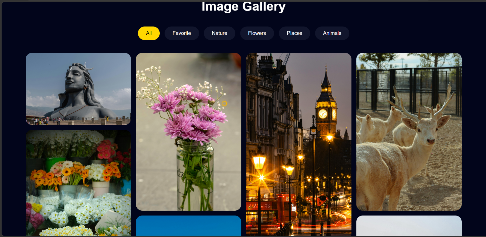
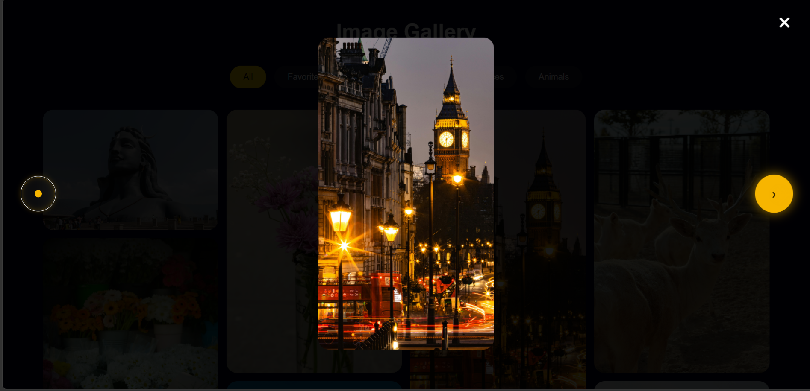
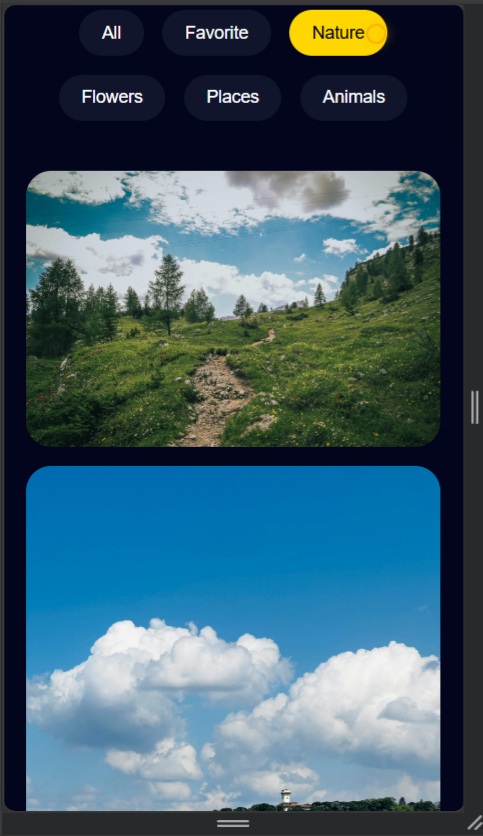

<h1 align="center">📸 CodeAlpha Image Gallery</h1>

<p align="center">
A Responsive Image Gallery built using HTML, CSS, and JavaScript with category filters, lightbox preview, custom cursor effects, and fully responsive design as part of the CodeAlpha Frontend Development Internship.
</p>

---

## 🚀 Live Demo

[View Live Project](https://srinaina2007-sudo.github.io/CodeAlpha_Image-gallery/)

---

## ✨ Features

- Responsive Image Gallery
- Interactive Lightbox View
- Smooth Hover Effects
- Next/Previous Navigation
- Mobile-Friendly Design
- Category Filters

---

## 🛠️ Technologies Used

- HTML5
- CSS3
- JavaScript

---

## 📸 Screenshots

### 🖼️ Homepage

<p align="center">
  
</p>

---

### 🔍 Lightbox View

<p align="center">
  
</p>

---

### 📱 Mobile Responsive View

<p align="center">
  
</p>

---

## 📂 Project Structure

```text
CodeAlpha_Image-gallery/
│── index.html
│── style.css
│── script.js
│── README.md
│── images/
```

---

## 👨‍💻 Author

Sri Naina

GitHub: https://github.com/srinaina2007-sudo